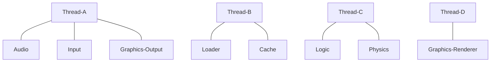
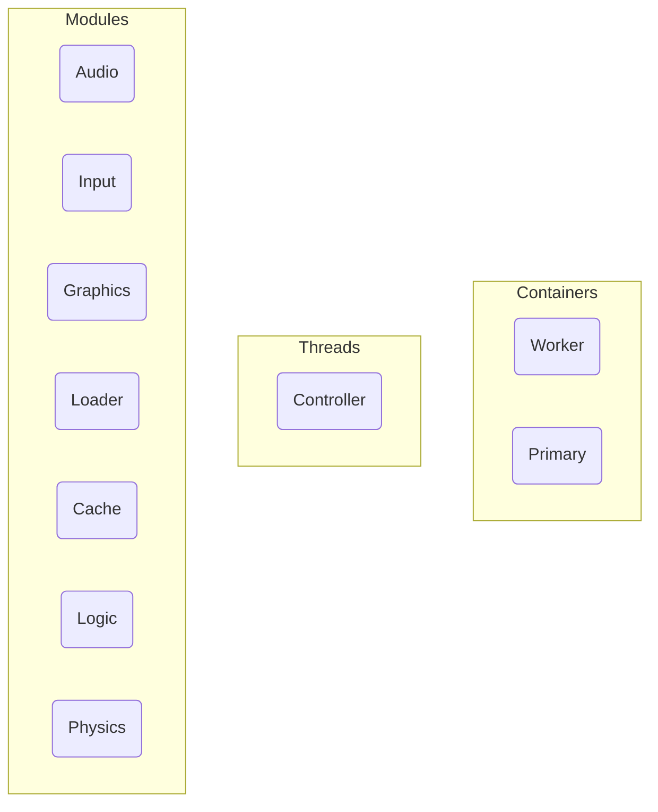
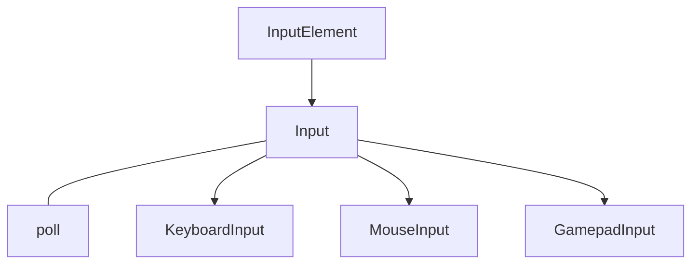

### Elements

```mermaid
graph TD;
Thread-A --- Audio;
Thread-A --- Input;
Thread-A --- Graphics-Output;

Thread-B --- Loader;
Thread-B --- Cache;

Thread-C --- Logic;
Thread-C --- Physics;

Thread-D --- Graphics-Renderer;
```

### Element Layout

```mermaid
graph TD;
  subgraph Containers;
    worker(Worker);
    primary(Primary);
  end;

  subgraph Threads;
    controller(Controller);
  end;

  subgraph Modules;
    audio(Audio);
    input(Input);
    graphics(Graphics);
    loader(Loader);
    cache(Cache);
    logic(Logic);
    physics(Physics);
  end;
```

### Input

```mermaid
graph TD;

InputElement --> Input;

Input --- poll;

Input --> KeyboardInput;
Input --> MouseInput;
Input --> GamepadInput;
```