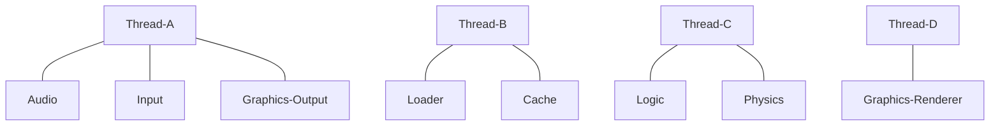
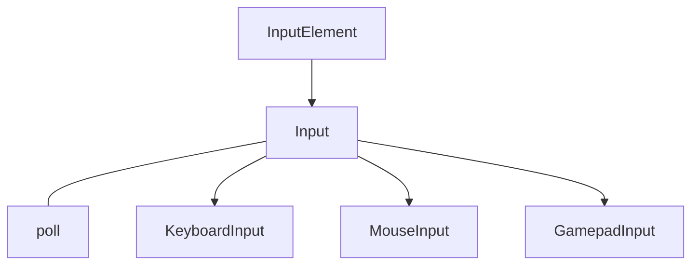

### Elements

```mermaid
graph TD;
Thread-A --- Audio;
Thread-A --- Input;
Thread-A --- Graphics-Output;

Thread-B --- Loader;
Thread-B --- Cache;

Thread-C --- Logic;
Thread-C --- Physics;

Thread-D --- Graphics-Renderer;
```

### Input

```mermaid
graph TD;

InputElement --> Input;

Input --- poll;

Input --> KeyboardInput;
Input --> MouseInput;
Input --> GamepadInput;
```